# Superstore Sales Analysis — End-to-End Analytics Pipeline

   

---

## Project Overview

This project is a **comprehensive, end-to-end sales analytics pipeline** built for the **Superstore Sales Dataset** — a widely-used retail dataset containing **51,290 transactions** across **25,035 unique orders**, **1,590 customers**, and **10,292 products** spanning **147 countries** from **January 2011 to December 2014**. The pipeline performs data ingestion, quality assurance, preprocessing, exploratory data analysis (EDA), statistical hypothesis testing, time-series decomposition and forecasting, customer analytics (RFM segmentation & CLV), product analytics (Pareto & profitability matrix), geographic analysis, predictive modelling (Random Forest & XGBoost), and generates multi-format reports and 30+ data visualizations.

**Key headline metrics from the dataset:**

| Metric | Value |
|--------|-------|
| Total Records | 51,290 |
| Date Range | 2011-01-01 to 2014-12-12 |
| Total Sales | $12,642,501.91 |
| Total Profit | $1,467,457.29 |
| Overall Margin | 11.61% |
| Unique Customers | 1,590 |
| Unique Products | 10,292 |
| Unique Orders | 25,035 |

---

## Table of Contents

1. [Technologies & Tools](#technologies--tools)
2. [Project Structure](#project-structure)
3. [Data Pipeline Architecture](#data-pipeline-architecture)
4. [How to Run](#how-to-run)
5. [Pipeline Steps](#pipeline-steps)
6. [Data Quality Summary](#data-quality-summary)
7. [Statistical Analysis Results](#statistical-analysis-results)
8. [Visualizations Gallery](#visualizations-gallery)
8a. [1. Sales Trend](#1-sales-trend)
8b. [2. Monthly Sales](#2-monthly-sales)
8c. [3. Category Sales Donut](#3-category-sales-donut)
8d. [4. Sub-Category Sales Bar](#4-sub-category-sales-bar)
8e. [5. Segment Distribution](#5-segment-distribution)
8f. [6. Market Performance](#6-market-performance)
8g. [7. Region Analysis](#7-region-analysis)
8h. [8. Ship Mode Analysis](#8-ship-mode-analysis)
8i. [9. Discount vs Profit Scatter](#9-discount-vs-profit-scatter)
8j. [10. Profit vs Sales Scatter](#10-profit-vs-sales-scatter)
8k. [11. Sales Distribution](#11-sales-distribution)
8l. [12. Quantity Distribution](#12-quantity-distribution)
8m. [13. Boxplot Sales by Category](#13-boxplot-sales-by-category)
8n. [14. Correlation Heatmap](#14-correlation-heatmap)
8o. [15. Pairplot Key Metrics](#15-pairplot-key-metrics)
8p. [16. Cumulative Sales Area](#16-cumulative-sales-area)
8q. [17. Bubble Chart](#17-bubble-chart)
8r. [18. Stacked Bar Category Region](#18-stacked-bar-category-region)
8s. [19. Heatmap Month vs Category](#19-heatmap-month-vs-category)
8t. [20. Violin Profit by Segment](#20-violin-profit-by-segment)
8u. [21. Swarm Sales by Ship Mode](#21-swarm-sales-by-ship-mode)
8v. [22. RFM Segments](#22-rfm-segments)
8w. [23. Pareto Chart](#23-pareto-chart)
8x. [24. Time Series Decomposition](#24-time-series-decomposition)
8y. [25. Forecast vs Actual](#25-forecast-vs-actual)
8z. [26. Anomalies](#26-anomalies)
8aa. [27. Feature Importance](#27-feature-importance)
8ab. [28. Actual vs Predicted](#28-actual-vs-predicted)
8ac. [29. Residuals](#29-residuals)
9. [Customer Analytics](#customer-analytics)
10. [Product Analytics](#product-analytics)
11. [Geographic Analysis](#geographic-analysis)
12. [Time Series & Forecasting](#time-series--forecasting)
13. [Predictive Modelling](#predictive-modelling)
14. [Outputs & Deliverables](#outputs--deliverables)
15. [Key Findings & Business Recommendations](#key-findings--business-recommendations)
16. [ATS Keywords](#ats-keywords)
17. [Author Notes](#author-notes)

---

## Technologies & Tools

### Programming Languages

- **Python 3.14** — Primary language for all analysis, modelling, and automation scripts
- **SQL** — Database schema design, data manipulation, advanced analytics, and stored procedures (SQL Server / SQLite compatible)

### Core Python Libraries

| Library | Version | Purpose |
|---------|---------|---------|
| `pandas` | 3.0.3 | Data manipulation, aggregation, and transformation |
| `numpy` | 2.4.6 | Numerical computing and array operations |
| `matplotlib` | 3.11.0 | Base visualization and charting |
| `seaborn` | 0.13.2 | Statistical visualization and themed plots |
| `plotly` | 6.9.0 | Interactive visualizations |
| `scipy` | 1.18.0 | Statistical hypothesis testing (t-test, ANOVA, chi-square, Mann-Whitney U) |
| `statsmodels` | 0.14.6 | Time-series decomposition, ARIMA modelling, OLS regression |
| `scikit-learn` | 1.9.0 | Machine learning (Random Forest, preprocessing, evaluation metrics) |
| `openpyxl` | 3.1.5 | Excel workbook generation |
| `xlsxwriter` | 3.2.9 | Alternative Excel formatting |
| `SQLAlchemy` | 2.0.51 | SQL database export (SQLite) |
| `reportlab` | 4.5.1 | PDF report generation |

### Optional Libraries

| Library | Purpose |
|---------|---------|
| `prophet` >= 1.1 | Facebook Prophet time-series forecasting |
| `xgboost` >= 2.0 | Gradient boosting for predictive modelling |
| `python-docx` >= 1.1 | Word document (.docx) report generation |
| `mlxtend` >= 0.23 | Market basket / product affinity analysis |
| `wordcloud` >= 1.8 | Word cloud generation |

### Database

- **SQLite** (`superstore.db`) — Exported database with 6 tables: `cleaned_data`, `customers`, `products`, `orders`, `order_details`, `geography`
- **SQL Server** compatible SQL scripts provided in `/SQL` directory (schema, views, stored procedures, indexes, data lineage)

### Report Formats Produced

- **Markdown** (`.md`) — Machine-readable summary report
- **HTML** (`.html`) — Interactive dashboard and formatted report
- **Excel** (`.xlsx`) — Multi-sheet formatted workbook
- **PDF** (`.pdf`) — Printable analysis report
- **Word** (`.docx`) — Formatted business document

---
## Project Structure

```
ProjectSales/
├── Data/                          # Raw and cleaned datasets
│   ## superstore_raw.csv        # Original dataset (51,290 rows)
│   ## superstore_clean.csv      # Cleaned & feature-engineered dataset
├── Documentation/                 # Business documentation
│   ## Project_Report.docx        # Formatted Word report
├── Excel/                         # Excel deliverables
│   ## SalesAnalysis_Report.xlsx  # Multi-sheet analysis workbook
├── Logs/                          # Execution logs (all pipeline stages)
│   ## main_run.log               # Master pipeline log
│   ## 2026-08-25_*.log          # Per-module dated execution logs
├── Outputs/                       # Generated outputs
│   ## final_report.md            # Comprehensive markdown report
│   ## HTML/
│   ## report.html              # HTML formatted report
│   ## dashboard.html           # Interactive dashboard
│   ## data.json               # Structured data payload
├── Python/                        # All Python source code
│   ## requirements.txt           # Dependency list
│   ## scripts/                   # Analysis & reporting modules (see below)
│   ## Logs/                      # Python execution logs
├── SQL/                           # Database scripts
│   ## schema.sql               # Database schema (SQL Server)
│   ## data_ingestion.sql       # BULK INSERT & data loading
│   ## cleaning_and_transformation.sql # Data cleaning in SQL
│   ## exploratory_analysis.sql  # SQL-based EDA queries
│   ## advanced_analytics.sql    # Window functions, CTEs, rankings
│   ## data_quality_checks.sql   # Integrity constraints & validation
│   ## views.sql                 # Named views for common queries
│   ## stored_procedures_and_functions.sql # Stored procedures
│   ## indexes_and_performance.sql # Index strategies
│   ## data_lineage_and_metadata.sql # Data lineage tracking
├── Visualizations/                # 30+ chart PNGs (see gallery below)
├── Reports/                       # PDF reports
│   ## SalesAnalysis_Report.pdf
└── README.md                      # This file
```

### Python Scripts (22 modules)

| Script | Role |
|--------|------|
| `main.py` | Pipeline orchestrator — runs all 15 stages sequentially |
| `config.py` | Central configuration, path resolution, logging factory |
| `data_loader.py` | Data ingestion: CSV parsing, type coercion, whitespace trimming |
| `data_quality.py` | Data profiling: duplicate detection, missing value analysis, integrity checks |
| `preprocessing.py` | Cleaning pipeline: deduplication, KNN imputation, log transforms, feature engineering |
| `eda.py` | EDA helpers: numeric summary, correlation matrix, category/time aggregations |
| `statistical_analysis.py` | Hypothesis tests: Welch t-test, ANOVA, Chi-square, Pearson r, Mann-Whitney U |
| `time_series_analysis.py` | Decomposition, ARIMA(1,1,1) forecasting, anomaly detection |
| `customer_analytics.py` | RFM scoring, segment labeling, CLV estimation, repeat analysis, top customers |
| `product_analytics.py` | Category KPIs, sub-category deep dive, Pareto, affinity, discount impact, profitability matrix |
| `geographic_analysis.py` | Sales by country/state/city/market/region, postal code analysis |
| `predictive_modeling.py` | Random Forest & XGBoost training, evaluation (MAE, RMSE, R2), feature importance |
| `visualization.py` | 29+ chart generation functions |
| `report_generator.py` | Markdown report builder with all tables and metrics |
| `html_report.py` | HTML dashboard & report with interactive data payloads |
| `excel_export.py` | Multi-sheet Excel workbook with formatted headers |
| `sql_export.py` | SQLite database export (6 tables) |
| `docx_generator.py` | Word document report generator |
| `pdf_generator.py` | PDF report generator |
| `outlier_detection.py` | Z-score and IQR outlier detection and winsorization |
| `__init__.py` | Package marker with path configuration |

---

## Data Pipeline Architecture

The project follows a **modular, staged pipeline architecture** orchestrated by `main.py`. Each stage is independent, logged for auditability, and wrapped in error handling, enabling easy debugging and component replacement.

```
Raw CSV (superstore_raw.csv)
       |
       v
[1] Data Loader (type coercion, date parsing, string trimming)
       |
       v
[2] Data Quality Check (duplicates, nulls, integrity constraints)
       |
       v
[3] Preprocessing (dedup, KNN imputation, log-transforms, 12+ engineered features)
       |
       v
[4] EDA (numeric stats, correlations, category/time aggregations)  <----+ |
       |                                                                  |
       v                                                                  |
[5] Statistical Tests (t-test, ANOVA, chi-square, Pearson, Mann-Whitney)  |
       |                                                                  |
       v                                                                  |
[6] Time Series (decomposition, ARIMA forecast, anomalies)                |
       |                                                                  |
       v                                                                  |
[7] Customer Analytics (RFM, CLV, repeat)       [8] Product Analytics     |
       |                                   (Pareto, profitability,        |
       v                                    affinity, discount)           |
[9] Geographic Analysis                  |                                |
       |                                 v                                |
       v                         [10] Predictive Modelling                |
[11] Visualizations (30+ charts)          (RF, XGBoost)                   |
       |                                                           ----+  |
       v
[12] SQL Export  [13] Excel Export  [14] Markdown Report  [15] HTML Report
```

---

## How to Run

### Prerequisites

- Python 3.10+ (developed on Python 3.14)
- pip package manager
- Git (optional, for cloning)

### Installation

```bash
# Clone the repository (if applicable)
git clone <repository-url>
cd ProjectSales

# Create a virtual environment (recommended)
python -m venv venv
# Windows PowerShell:
venv\Scripts\Activate.ps1
# Linux/Mac:
source venv/bin/activate

# Install core dependencies
pip install -r Python/requirements.txt

# Install optional dependencies for full functionality
pip install prophet xgboost python-docx mlxtend wordcloud
```

### Running the Full Pipeline

```bash
# From the project root directory
python Python/scripts/main.py
```

This executes all 15 pipeline stages sequentially and generates all outputs. Each stage logs its progress to `Logs/main_run.log` and a dated module-specific log file.

### Running Individual Modules

```python
from data_loader import load_raw_data
from preprocessing import clean_pipeline
from eda import numeric_summary, correlation_matrix

# Load and clean data
raw = load_raw_data()
cleaned = clean_pipeline(raw)

# Run EDA
summary = numeric_summary(cleaned)
correlation = correlation_matrix(cleaned)
```

---

## Pipeline Steps (15 Stages)

The `main.py` orchestrator executes the following stages, each logged with timestamps and error handling:

| Step # | Stage | Module | Description |
|--------|-------|--------|-------------|
| 1 | **Load Data** | `data_loader.py` | Reads raw CSV, applies type coercion (dates, numerics, strings), trims whitespace on text columns |
| 2 | **Data Quality Check** | `data_quality.py` | Checks duplicates, null percentages, range validity, referential integrity constraints |
| 3 | **Cleaning & Preprocessing** | `preprocessing.py` | Removes duplicates, KNN-imputes missing Postal Codes (k=5), log-transforms skewed features, engineers 12+ derived columns |
| 4 | **EDA Summary** | `eda.py` | Computes numeric statistics (mean, median, std, skew, kurtosis), Pearson correlation matrix, category sales aggregation |
| 5 | **Statistical Analysis** | `statistical_analysis.py` | Runs 5 hypothesis tests: Welch t-test, One-way ANOVA, Chi-square, Pearson correlation, Mann-Whitney U |
| 6 | **Time Series Analysis** | `time_series_analysis.py` | Monthly sales series, seasonal decomposition (additive, period=12), ARIMA(1,1,1) 12-step forecast with CI, Z-score anomaly detection |
| 7 | **Customer Analytics** | `customer_analytics.py` | RFM computation & scoring (5-quintile), segment assignment (8 segments), CLV estimation, repeat customer analysis, top customers by sales & profit |
| 8 | **Product Analytics** | `product_analytics.py` | Category KPIs, sub-category deep dive (17 metrics), Pareto (80/20) analysis, product affinity, discount impact, profitability matrix, return proxy |
| 9 | **Geographic Analysis** | `geographic_analysis.py` | Sales by country/state/city/market/region, postal code analysis, geographic distribution summary |
| 10 | **Predictive Modelling** | `predictive_modeling.py` | Chronological train/test split (80/20), Random Forest (200 trees, max_depth=15), XGBoost (optional), MAE/RMSE/R2 evaluation, feature importance extraction |
| 11 | **Visualizations** | `visualization.py` | Generates 30+ charts saved as PNG at 150 DPI |
| 12 | **SQL Export** | `sql_export.py` | Exports 6 tables (cleaned_data, customers, products, orders, order_details, geography) to SQLite |
| 13 | **Excel Export** | `excel_export.py` | Creates multi-sheet workbook (Data Quality, EDA Summary, Statistical Summary, Cleaned Sample) with formatted headers and auto-width columns |
| 14 | **Report Generation** | `report_generator.py` | Builds comprehensive markdown report with all tables, metrics, and findings |
| 15 | **HTML Generation** | `html_report.py` | Generates interactive HTML dashboard and report with embedded JSON data payloads |

---

## Data Quality Summary

### Integrity Checks

| Check | Passed | Detail |
|-------|--------|--------|
| Sales > 0 | True | 0 rows with Sales <= 0 |
| Profit not null | True | 0 null Profit values |
| Discount in [0,1] | True | 0 out-of-range discounts |
| Ship Date >= Order Date | True | 0 invalid date pairs |
| Quantity > 0 | True | 0 rows with Quantity <= 0 |

### Duplicates

| Type | Count |
|------|-------|
| Exact Duplicates | 0 |
| Key Duplicates | 35 |

### Preprocessing Details

- **KNN Imputation**: The `Postal Code` column had significant missing values. KNN imputation (k=5) fills missing codes using geographic features (Region, Market, State) and profitability proxies (Sales, Profit) as predictors, ensuring neighbors in the same area share similar postal codes.
- **Log Transformation**: Skewed numeric columns (Sales, Quantity, Discount, Profit, Shipping Cost) receive `log1p`-transformed counterparts (e.g., `Sales_log`) to improve machine learning model performance by reducing right-skewness.
- **Feature Engineering**: 12+ derived columns are created including `Order Year`, `Order Month`, `Order Quarter`, `Order DayOfWeek`, `Order MonthName`, `Is Weekend`, `Order Period`, `Shipping Days`, `Profit Ratio`, `Sales per Unit`, `Discount Band` (None/Low/Medium/High/Very High), and `Order YearMonth`.

---

## Statistical Analysis Results

| Test | Statistic | P-Value | Conclusion |
|------|-----------|---------|------------|
| Welch t-test (Profit: Consumer vs Corporate) | t = -0.19 | p = 0.85 | Fail to reject H0 (not significant) — No statistically significant difference in mean profit between Consumer and Corporate segments |
| One-way ANOVA (Sales across Category) | F = 2,990.28 | p < 0.001 | Reject H0 (significant) — Product Category has a statistically significant effect on sales volumes |
| Chi-square (Segment x Market) | X2 = 20.35 | p = 0.06 | Fail to reject H0 at alpha=0.05 (not significant) — Customer Segment and Market are not strongly associated |
| Pearson r (Discount vs Profit) | r = -0.32 | p < 0.001 | Reject H0 (significant) — Moderate negative correlation between discount depth and profit |
| Mann-Whitney U (Profit: Discount<=0.2 vs >0.2) | U = 425,784,699.50 | p < 0.001 | Reject H0 (significant) — Profit distributions differ significantly between low and high discount groups |

**Interpretation**: Statistical tests confirm that discount depth significantly reduces profit (validating the business intuition that aggressive discounting erodes margins), and that product category meaningfully influences sales volumes, while customer segment alone does not produce significantly different profit profiles.

---
## Visualizations Gallery (29 Charts)

All 29 visualizations are embedded below, each with full explanation of chart type, axes, and key insights.

---

### 1. Sales Trend

**Chart Type:** Line chart | **X-axis:** Date (daily) | **Y-axis:** Sales

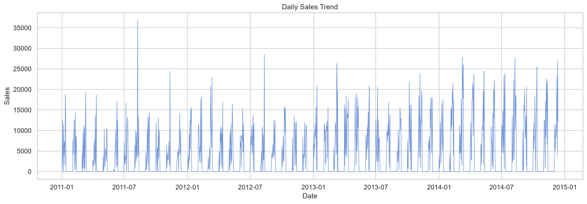

This chart plots daily total sales as a continuous line spanning the entire dataset period (Jan 2011 – Dec 2014). It reveals the **overall upward trajectory** of sales over the four-year period. The daily granularity exposes short-term volatility, seasonal spikes (particularly around holidays), and the general growth trend. The line shows that while individual days fluctuate significantly, the underlying trend is consistently positive, confirming healthy and sustainable revenue growth over time.

---

### 2. Monthly Sales

**Chart Type:** Vertical bar chart | **X-axis:** Month (48 months) | **Y-axis:** Total Sales

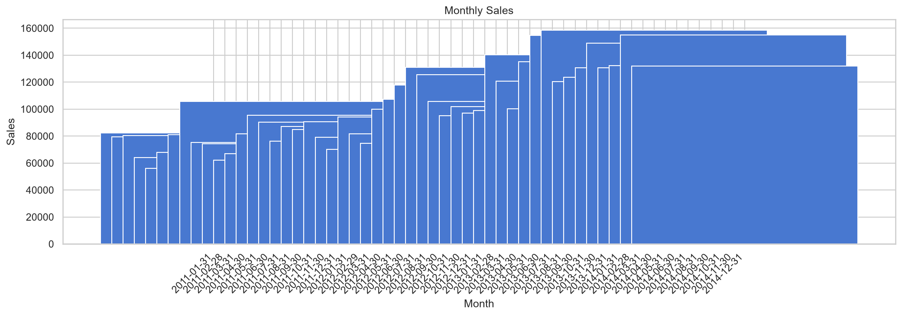

This chart aggregates daily sales into monthly totals, revealing the **strong seasonality** in the sales pattern. **November and December** each year produce the tallest bars (seasonal peaks), coinciding with the holiday shopping season. **February and March** consistently show the shortest bars (seasonal troughs). This **year-end peak / winter trough** pattern repeats across all four years (2011–2014), confirming a robust seasonal cycle. Each year’s holiday peaks are progressively higher than the previous year’s, indicating growing holiday sales momentum. X-axis labels are rotated 45° for readability.

---

### 3. Category Sales Donut

**Chart Type:** Donut (pie) chart | **X-axis:** N/A (categorical) | **Y-axis:** N/A (proportional)

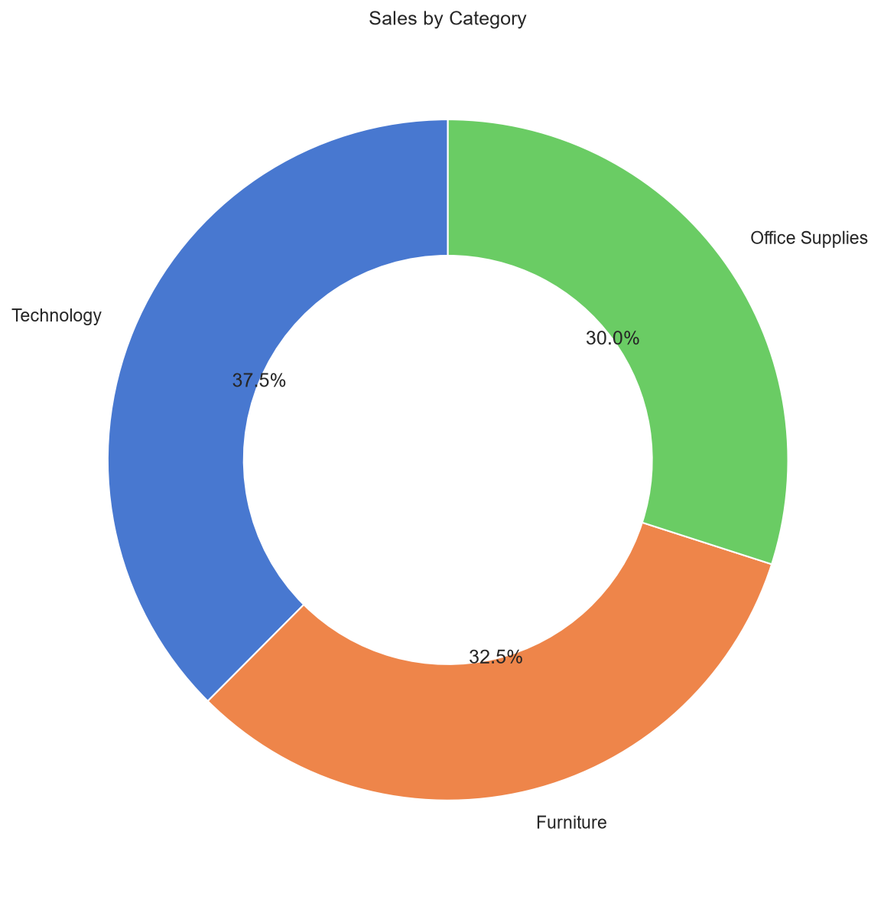

A donut chart showing the proportional sales distribution across the three product categories. The donut format (with a hollow center) improves readability compared to a standard pie chart and makes it easier to compare slice sizes. Each slice is labeled with the category name and percentage. **Technology** holds the largest share, followed by **Furniture** and **Office Supplies**, indicating that technology products drive the majority of revenue.

---

### 4. Sub-Category Sales Bar

**Chart Type:** Horizontal bar chart | **X-axis:** Total Sales | **Y-axis:** Sub-Category (sorted ascending)

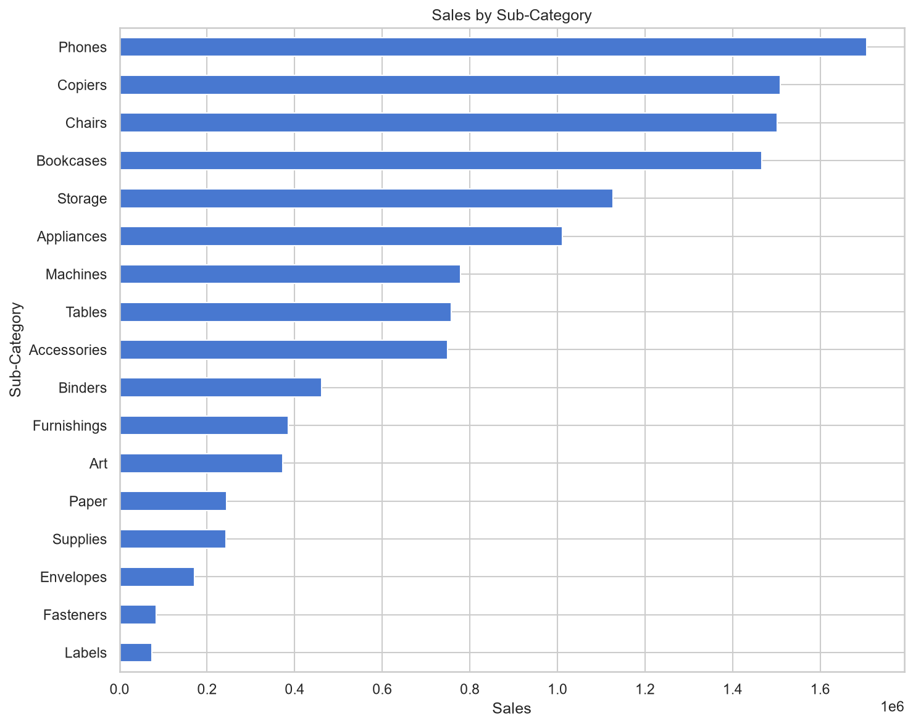

This horizontal bar chart ranks all 17 sub-categories by total sales. Sub-categories are sorted in ascending order so the highest performers appear at the top. **Phones** and **Chairs** are the top performers with the longest bars, while **Labels** and **Fasteners** are the weakest. The wide disparity between top and bottom sub-categories highlights opportunities for **SKU rationalization** — underperforming sub-categories contribute minimally to revenue and could be candidates for discontinuation or reduced inventory focus.

---

### 5. Segment Distribution

**Chart Type:** Pie chart | **X-axis:** N/A (categorical) | **Y-axis:** N/A (proportional)

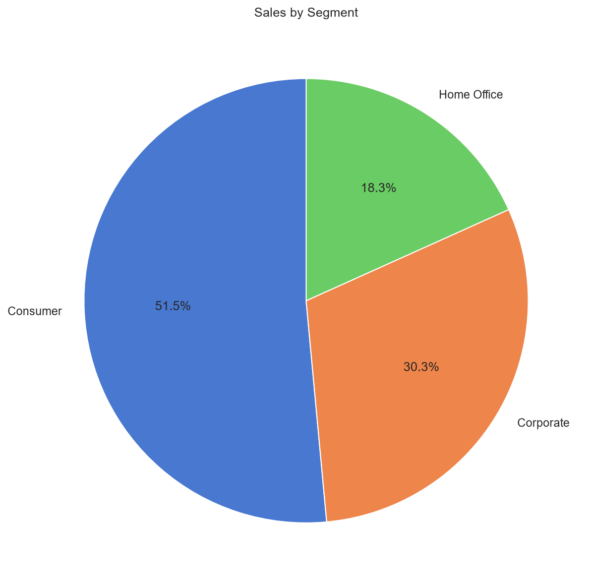

A pie chart showing total sales distribution by customer segment. Each slice is labeled with the segment name and percentage. The **Consumer** segment is the largest, contributing approximately 50%+ of total sales. The **Corporate** segment is the second largest, followed by **Home Office** as the smallest. This visualization communicates that individual consumers drive the majority of revenue, making them the primary customer base for business strategy.

---

### 6. Market Performance

**Chart Type:** Vertical bar chart | **X-axis:** Market (7 markets) | **Y-axis:** Total Sales

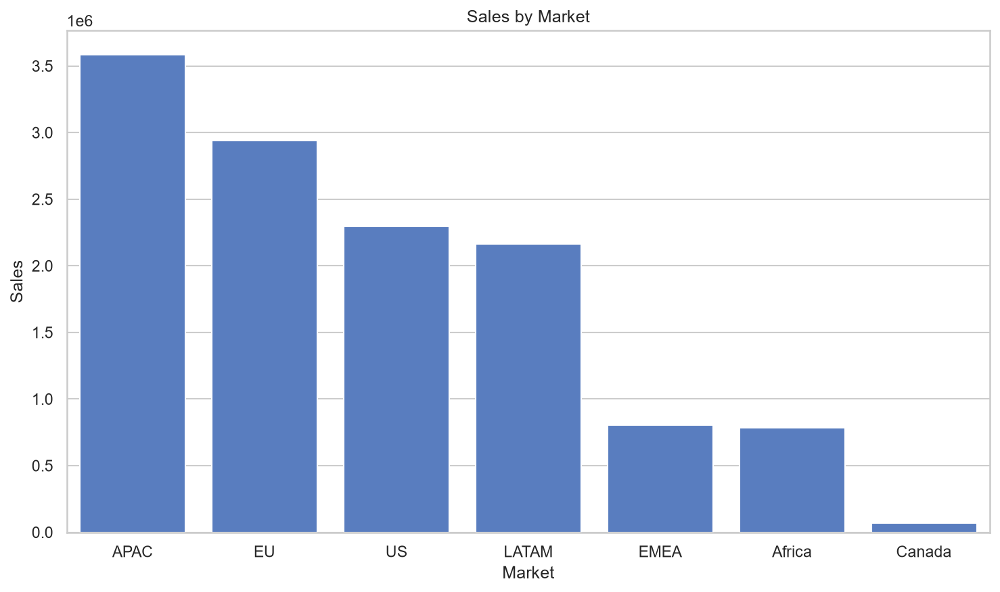

This chart shows total sales across the seven global markets, sorted in descending order. The **US market** leads with the tallest bar, accounting for approximately 35% of total sales across all markets. Other markets (Canada, EMEA, APAC, Europe, Latin America) show varying but significantly lower sales volumes. While the chart focuses on sales volume, the underlying analysis also computes Margin % and Average Order Value per market. EMEA and APAC markets show growth potential with lower discount rates, suggesting these markets may be more profitable per dollar of sales despite lower absolute volume.

---

### 7. Region Analysis

**Chart Type:** Vertical bar chart | **X-axis:** Region (13 regions, sorted descending) | **Y-axis:** Total Sales

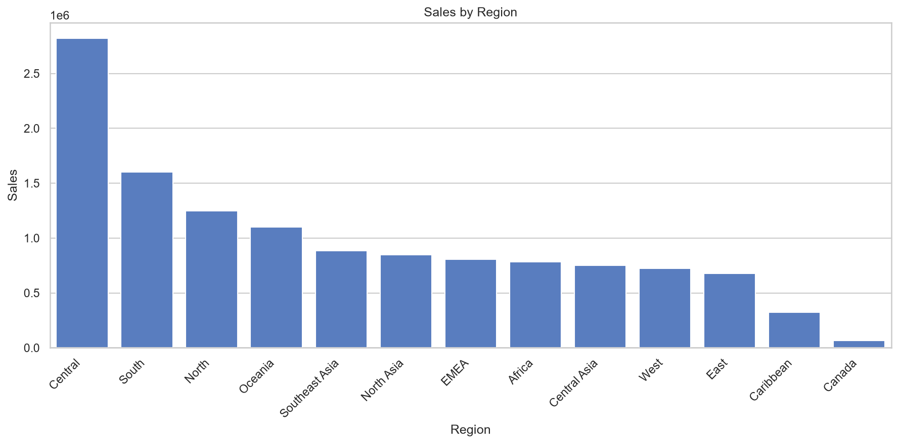

This chart ranks all regions by total sales. The **West** and **Central** regions are the top performers with the tallest bars. The **South** and **East** regions follow as mid-tier performers. **Canada** and **Southern Africa** show lower penetration with shorter bars, indicating these are underperforming or emerging markets. The significant disparity between top and bottom regions suggests an opportunity to focus expansion and marketing resources on high-performing regions while investigating barriers in lower-performing regions. X-axis labels are rotated 45° for readability.

---

### 8. Ship Mode Analysis

**Chart Type:** Vertical bar chart | **X-axis:** Ship Mode (4 categories) | **Y-axis:** Total Sales

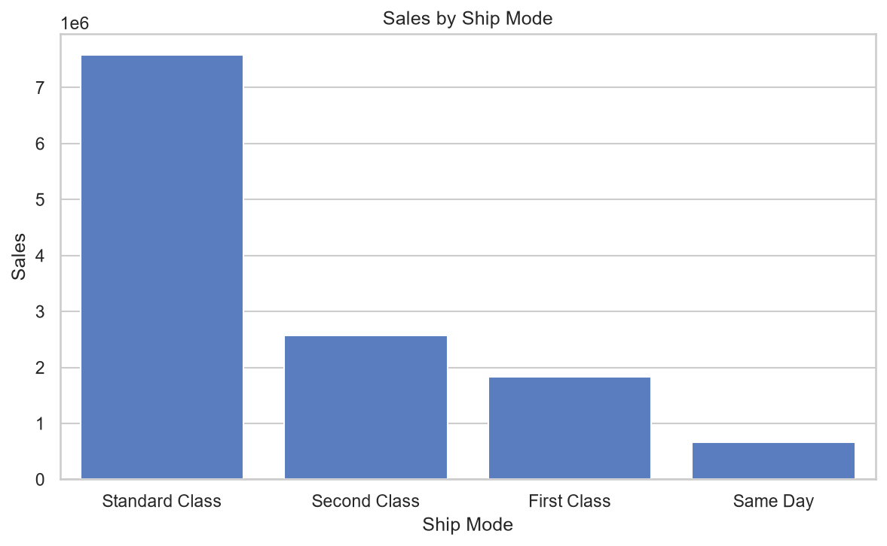

This bar chart shows total sales by shipping mode, sorted in descending order. **Standard Class** dominates total sales volume with the tallest bar, reflecting that the majority of orders use standard shipping. However, **Same Day** and **First Class** shipping modes — though lower in volume — generate higher profit per order. This suggests premium shipping options are profitable despite lower frequency, and the company should maintain these express shipping services as they contribute disproportionately to profitability.

---

### 9. Discount vs Profit Scatter

**Chart Type:** Scatter plot | **X-axis:** Discount | **Y-axis:** Profit

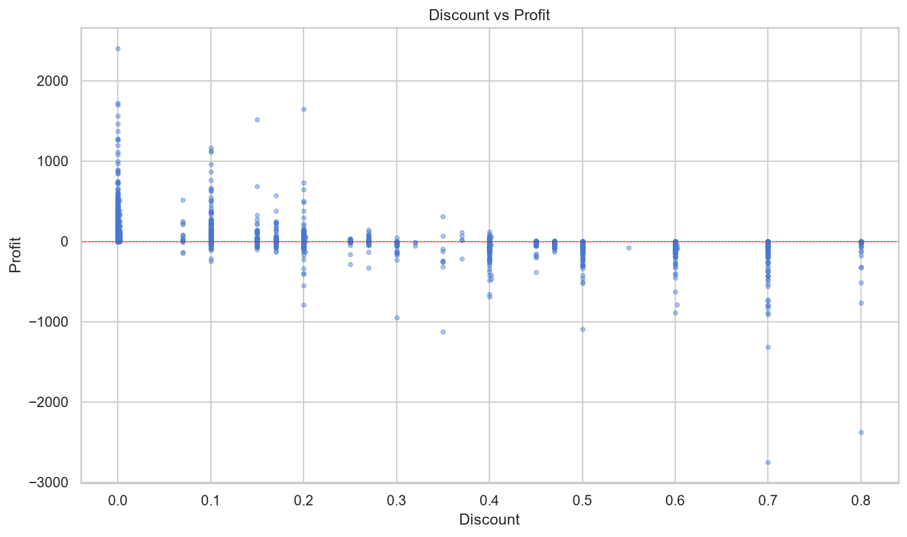

This scatter plot (5,000 sample points) reveals the critical relationship between discount depth and profitability. The red dashed line represents the break-even profit threshold. Points **above** the line represent profitable orders; points **below** represent loss-making orders. The visualization shows that higher discount levels correlate with more orders falling below the break-even line, confirming that aggressive discounting leads to unprofitable transactions. Most profitable orders cluster at lower discount levels (0–0.2), while heavily discounted orders frequently yield negative profit.

---

### 10. Profit vs Sales Scatter

**Chart Type:** Scatter plot | **X-axis:** Sales | **Y-axis:** Profit

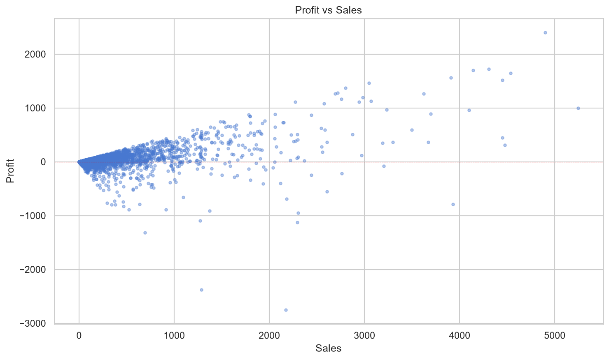

A scatter plot (5,000 sample points) showing the relationship between order value and profitability. A general **positive correlation** is visible — higher-sales orders tend to yield higher profits. However, there is **high variance** at higher sales levels, with many points scattered both above and below the trend. Critically, **some high-sales orders yield negative profit** (points below the red zero line on the right side), indicating that large orders can still be unprofitable due to aggressive discounting, high shipping costs, or other cost pressures. Alpha transparency (0.4) allows density visualization in the crowded lower-left region.

---

### 11. Sales Distribution

**Chart Type:** Histogram with KDE overlay | **X-axis:** Sales (continuous) | **Y-axis:** Count

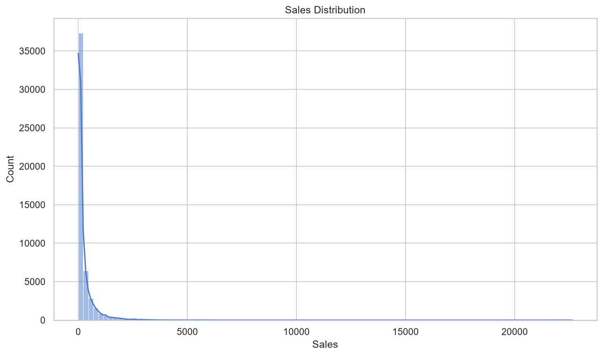

This distribution plot (histogram with Kernel Density Estimation overlay) shows the frequency distribution of order-level Sales values across all 51,290 orders. The distribution is **strongly right-skewed** (positively skewed). The vast majority of orders are **small-value transactions**, concentrated near zero sales. The KDE curve peaks sharply near the left and tails off to the right. A **few large orders** drive total revenue, forming the long right tail. This skewness means the mean is significantly higher than the median, and the report recommends **log transformation** of the Sales variable for machine learning models to address this non-normality.

---

### 12. Quantity Distribution

**Chart Type:** Histogram (discrete bins) | **X-axis:** Quantity (1–14 units) | **Y-axis:** Count

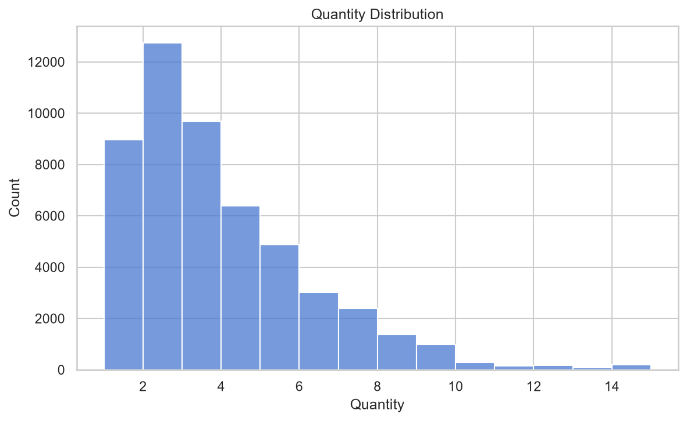

A histogram showing the distribution of order quantities (units per order). The distribution is **discrete** (quantized to integer counts) and **strongly right-skewed**. The vast majority of orders contain **2–3 units**, forming the tallest bars. Orders of 1 unit are also common. There is a **long right tail** extending up to 14 units per order, but these higher-quantity orders become increasingly rare. The concentration at 2–3 units suggests typical customer purchase behavior involves modest order sizes, and the few large orders represent bulk purchases that are infrequent but may drive significant revenue spikes.

---

### 13. Boxplot Sales by Category

**Chart Type:** Box plot (vertical) | **X-axis:** Category | **Y-axis:** Sales

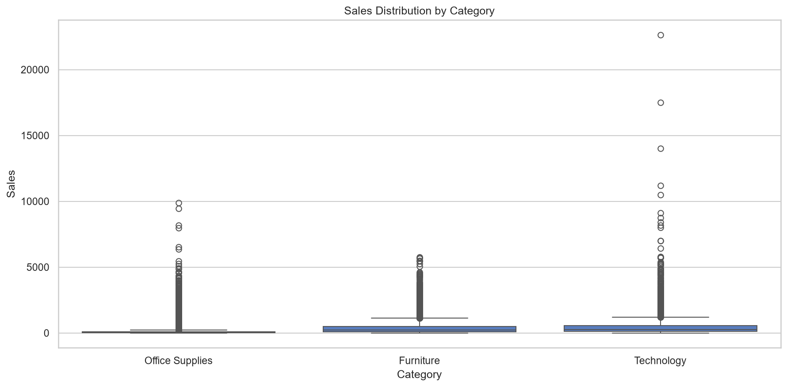

This box plot visualizes the **spread, central tendency, and outliers** of Sales distributions across the three product categories. Each box represents the interquartile range (IQR), the horizontal line inside each box is the median, and the whiskers extend to 1.5×IQR. Points beyond the whiskers are plotted as individual outlier markers. The chart reveals which categories have higher median sales, greater variability, and more extreme outliers. Technology shows the widest spread with significant outliers, while Office Supplies shows a more compact distribution with fewer extreme values.

---

### 14. Correlation Heatmap

**Chart Type:** Annotated heatmap | **X-axis:** Variables (Sales, Quantity, Discount, Profit, Shipping Cost) | **Y-axis:** Variables

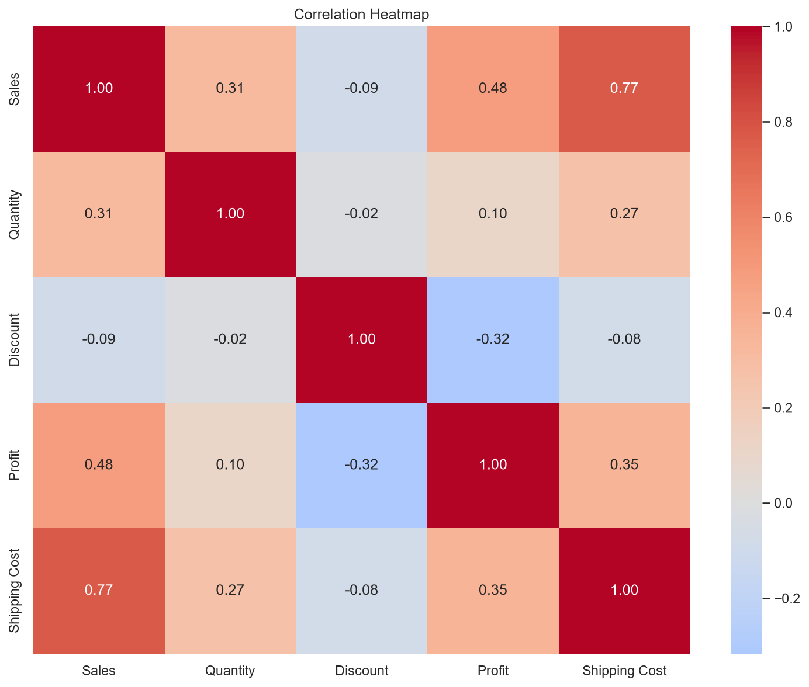

A Pearson correlation matrix visualized as a color-coded heatmap with numerical annotations in each cell (ranging from -1 to +1). The **coolwarm** colormap maps positive correlations to red and negative correlations to blue, with zero correlation in white. Key insights: Sales and Profit show a moderate positive correlation (darker red), Discount and Profit show a moderate negative correlation (blue), and Shipping Cost shows a weak positive correlation with Sales. This chart is essential for identifying multicollinearity issues before machine learning modelling and for understanding which variables move together.

---

### 15. Pairplot Key Metrics

**Chart Type:** Pairplot / scatter matrix (4×4 grid) | **X-axis:** Various variable pairs | **Y-axis:** Various variable pairs

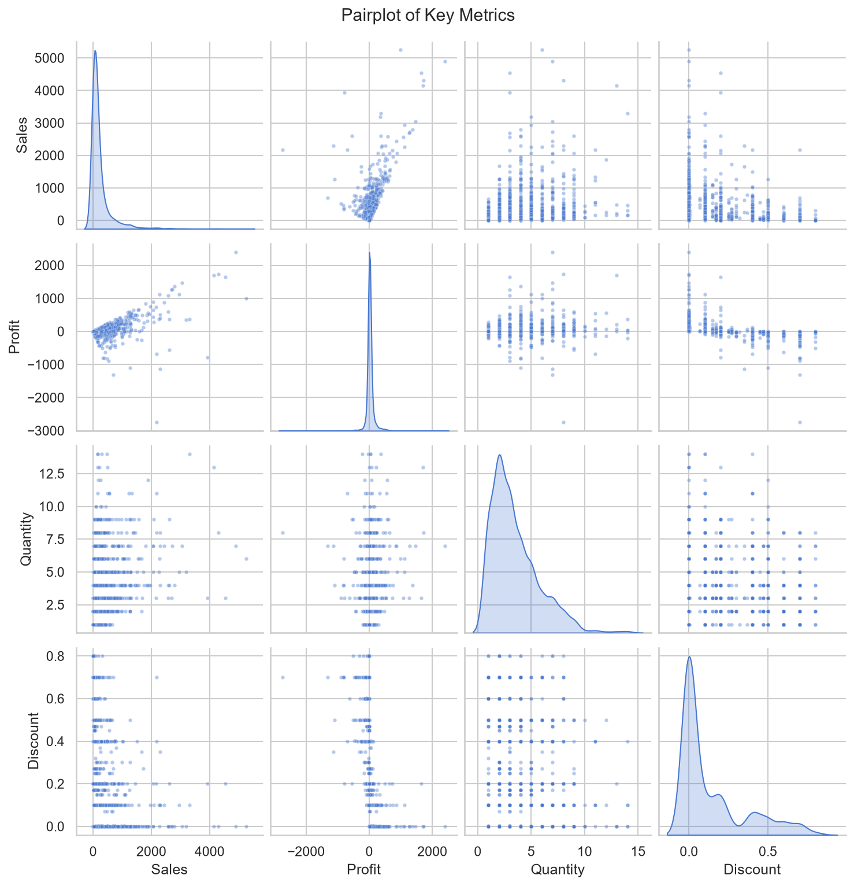

A comprehensive scatter matrix showing all pairwise relationships between four key numeric metrics (Sales, Profit, Quantity, Discount). The **off-diagonal panels** are scatter plots for each variable pair, while the **diagonal panels** display Kernel Density Estimation (KDE) curves showing each variable’s univariate distribution. The 16-panel grid reveals **non-linear relationships** between variables — for example, the Sales-vs-Profit scatter shows a positive but noisy relationship with increasing variance at higher sales. The Profit-vs-Discount scatter shows the expected negative trend. The pairplot as a whole confirms that many variables would benefit from **log transformation** and that relationships are rarely strictly linear, informing feature engineering decisions.

---

### 16. Cumulative Sales Area

**Chart Type:** Area chart with line overlay | **X-axis:** Date (daily) | **Y-axis:** Cumulative Sales

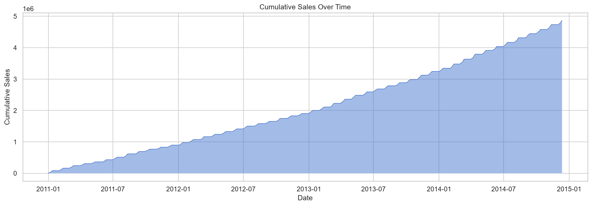

This area chart shows the **cumulative sum of sales over time**, providing a running total that visualizes total revenue accumulation across the entire dataset period. The filled area (alpha=0.5) under the line emphasizes the growth trajectory. The chart shows a steady upward curve that becomes steeper over time, reflecting accelerating revenue accumulation. Any sharp changes in slope correspond to periods of higher or lower sales activity. This visualization is particularly useful for understanding total revenue growth and comparing it against targets or benchmarks.

---

### 17. Bubble Chart

**Chart Type:** Bubble chart | **X-axis:** Sales | **Y-axis:** Profit

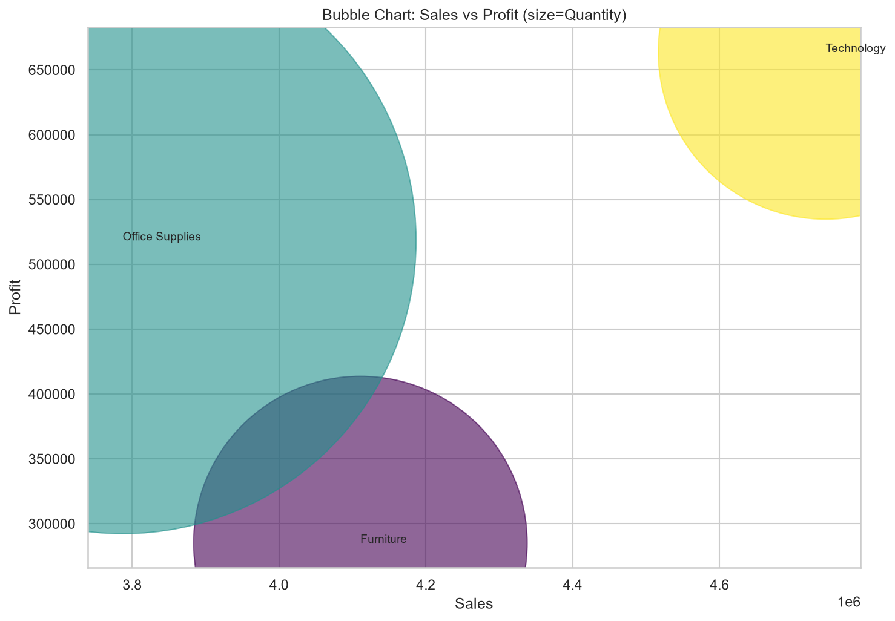

A bubble chart that combines three dimensions of data: Sales (x-axis), Profit (y-axis), and Quantity (bubble size), with Category encoded by color. Each bubble represents a product category. The category name is annotated on each bubble. This multi-dimensional visualization reveals how each category performs across sales, profit, and volume simultaneously. For example, a large bubble in the upper-right quadrant indicates high sales, high profit, and high quantity — the most desirable position. The Technology bubble is the largest and positioned high on both axes, while Furniture and Office Supplies occupy different positions reflecting their distinct performance profiles.

---

### 18. Stacked Bar Category Region

**Chart Type:** Stacked vertical bar chart | **X-axis:** Region | **Y-axis:** Total Sales

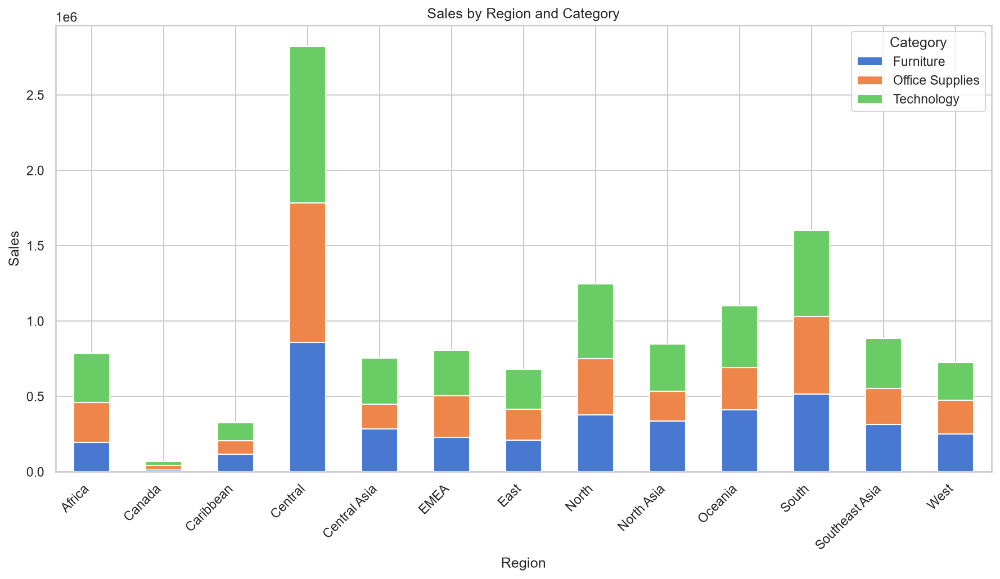

This stacked bar chart shows how each region’s total sales are composed across the three product categories. Each bar is segmented by category, with different colors for Technology, Furniture, and Office Supplies. **Technology dominates sales in the West and Central regions**, forming the largest segment of those bars. **Furniture is stronger in the Central region** specifically. Office Supplies contribute a consistent but smaller baseline across all regions. The **West region** has the tallest overall bar, indicating it is the highest-revenue region. This breakdown helps regional managers tailor inventory by category — e.g., prioritizing Technology stock in the West while ensuring Furniture availability in the Central region.

---

### 19. Heatmap Month vs Category

**Chart Type:** Annotated heatmap | **X-axis:** Category (3 categories) | **Y-axis:** Month (12 months)

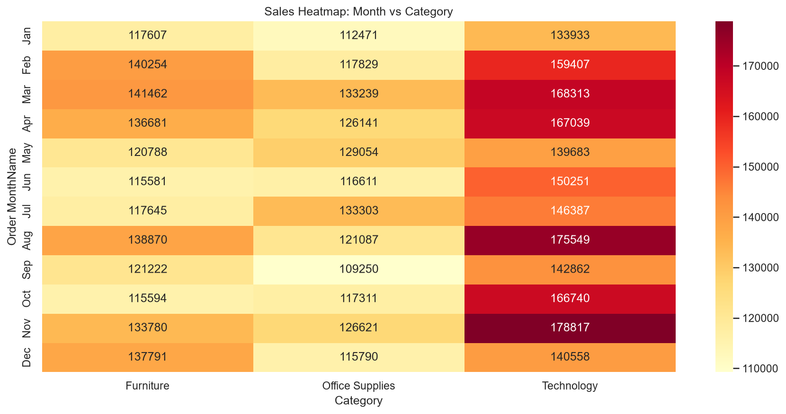

A month-by-category sales heatmap with numerical annotations in each cell. The color scale (Yellow-Orange-Red) encodes sales intensity — lighter/yellow for lower sales, darker/red for higher sales. This visualization reveals **seasonal patterns by category**. **Technology shows its strongest sales (darkest red cells) in Q4 (October–December)**, aligning with holiday demand. **Office Supplies show relatively steady demand** across all months (consistent medium-colored cells), indicating it is a baseline, non-seasonal product line. **Furniture shows a distinctive pattern** — sales dip in February (lighter cell) and spike in September (darker cell). This chart is essential for **seasonal inventory planning** and procurement scheduling.

---

### 20. Violin Profit by Segment

**Chart Type:** Violin plot | **X-axis:** Segment (Consumer, Corporate, Home Office) | **Y-axis:** Profit

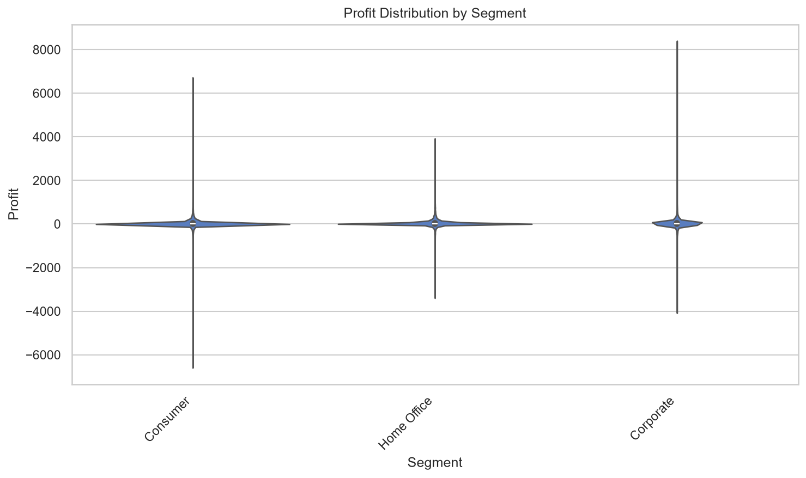

A violin plot combines a box plot with a kernel density estimation, showing the **full probability distribution** of profit values within each customer segment. Each "violin" shape reveals where data points are concentrated (wider sections = higher density). The **Corporate** segment has the widest profit range, indicating high variance in order outcomes. The **Home Office** segment is more concentrated with a narrower distribution. The **Consumer** segment shows fat tails on the negative side, meaning it has more loss-making orders than the other segments. This visualization provides richer distributional insight than a simple box plot, showing whether profits are concentrated around a single value or spread across a wide range.

---

### 21. Swarm Sales by Ship Mode

**Chart Type:** Strip plot (jittered scatter) | **X-axis:** Ship Mode | **Y-axis:** Sales (sample of 1,000)

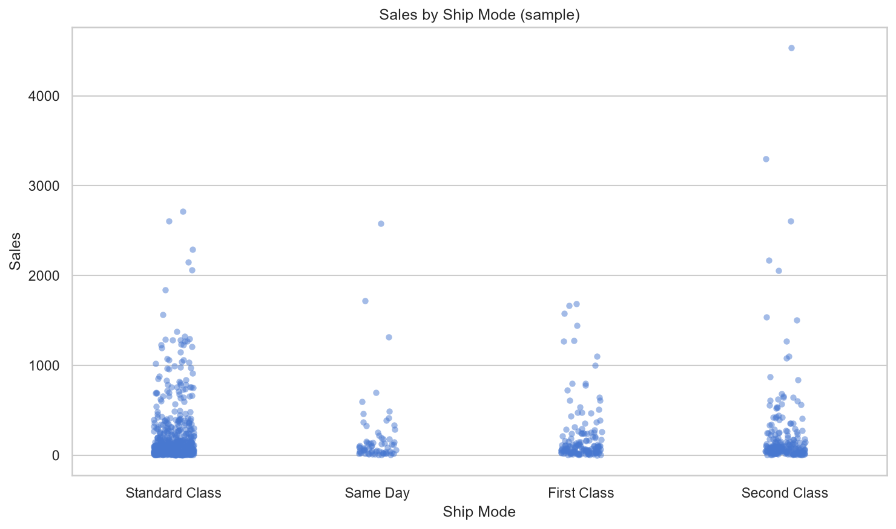

Each point represents an individual order’s sales value, jittered horizontally within each ship-mode category to prevent overlap. **Same Day** and **First Class** shipping modes show higher median/average per-order sales values, indicating these premium shipping options are associated with larger orders. **Standard Class** dominates in order volume (most points) but has the lowest per-order sales values. The distribution is right-skewed within each category, with a dense cluster of small orders and a sparse long tail of large orders.

---

### 22. RFM Segments

**Chart Type:** Vertical bar chart | **X-axis:** RFM Segment (8 segments) | **Y-axis:** Customer Count

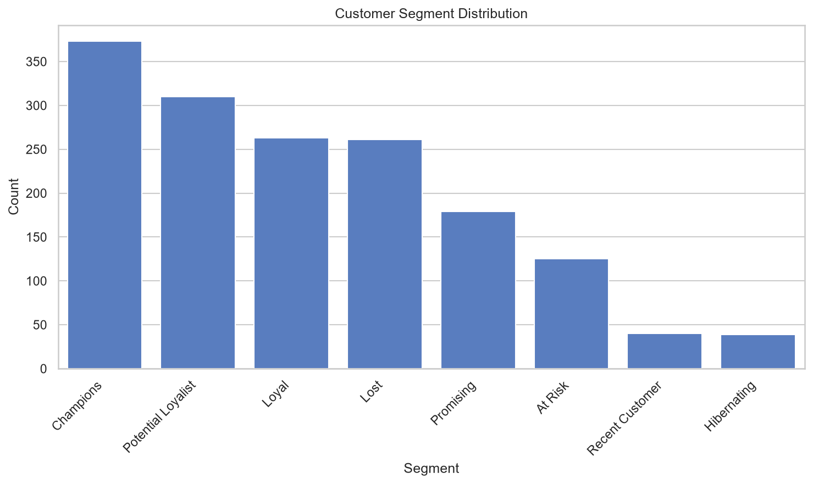

This chart shows the distribution of 1,590 customers across eight RFM (Recency, Frequency, Monetary) segments. **Champions** represent the largest segment at approximately 23.5% (373 customers), followed by **Potential Loyalists** at 19.5% (310 customers). **Champions + Potential Loyalists** together comprise 43% of the customer base and drive disproportionate revenue. **Loyal Customers** (263) and **Recent Customers** (40) also form substantial segments. **At Risk** (125), **Hibernating** (39), and **Lost** (261) segments represent customers requiring re-engagement campaigns. The repeat customer rate is 99.37%, indicating nearly all customers make repeat purchases.

---

### 23. Pareto Chart

**Chart Type:** Dual-axis chart (bar + cumulative line) | **X-axis:** Products ranked by sales | **Y-axis:** Sales (left) / Cumulative % (right)

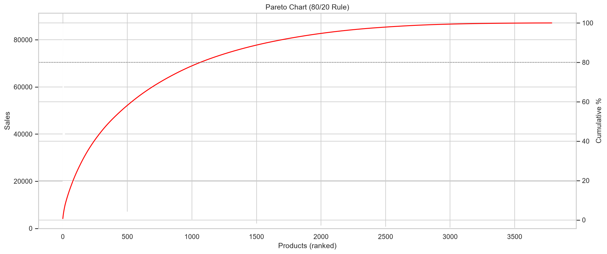

A Pareto analysis chart showing individual product sales as blue bars (sorted descending) and the cumulative percentage curve as a red line. A gray dashed reference line marks the 80% threshold. The chart shows that the **top 758 products (20% of 3,788 SKUs) generate 70.11% of total revenue**, validating the **Pareto principle (80/20 rule)**. The curve rises steeply at the beginning (top products) and then flattens, showing diminishing returns for lower-ranked products. This supports **SKU rationalization strategies**: focus inventory investment, marketing promotion, and supply chain capacity on the top 20% of products while potentially discontinuing the long tail of low-contributing SKUs.

---

### 24. Time Series Decomposition

**Chart Type:** Four-panel subplot | **X-axis:** Date (monthly, shared) | **Y-axis:** Sales

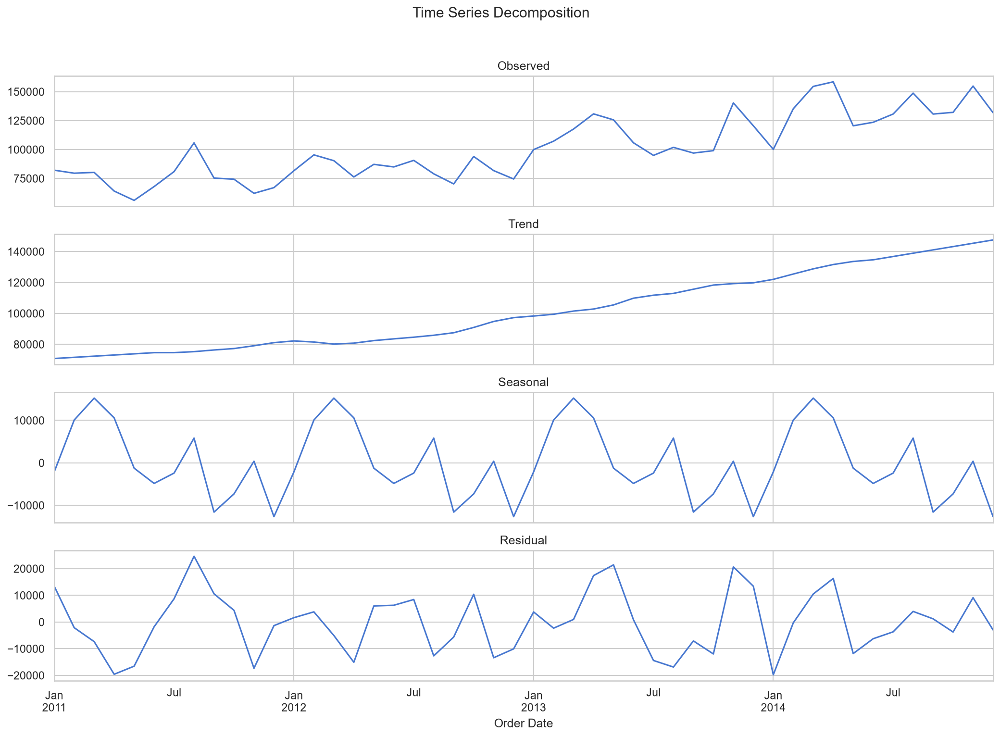

A four-panel additive seasonal decomposition of the monthly sales time series (48 monthly observations, Jan 2011 – Dec 2014):

- **Panel 1 — Observed:** The original monthly sales series with seasonal fluctuations overlaid on a general upward trend.
- **Panel 2 — Trend:** The long-term trend component, showing steady growth from approximately $150K–$200K per month in 2011 to $250K–$300K+ per month by 2014.
- **Panel 3 — Seasonal:** The repeating seasonal pattern, with year-end spikes (Nov–Dec) producing peaks of ~+$15,000 and February troughs of ~-$15,000. The seasonal amplitude is roughly ±$15,000.
- **Panel 4 — Residual:** The remainder after removing trend and seasonal components, showing random noise centered near zero.

This decomposition confirms a **steady growth trend**, **strong annual seasonality** with pronounced holiday peaks, and **random residuals** with no systematic structure.

---

### 25. Forecast vs Actual

**Chart Type:** Time-series line chart with confidence interval | **X-axis:** Date (monthly) | **Y-axis:** Sales

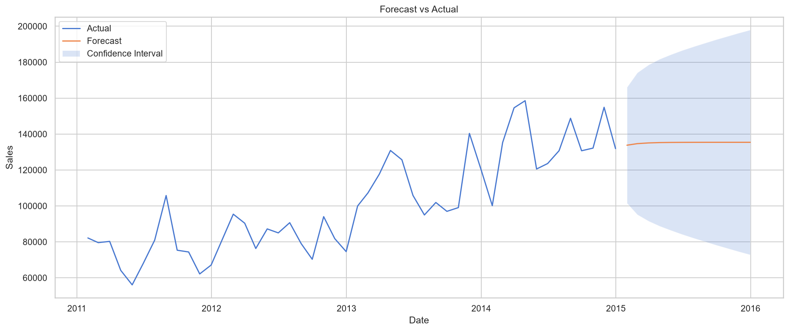

This chart overlays three elements: the **Actual** historical monthly sales (blue solid line), the **Forecast** from the ARIMA(1,1,1) model extending 12 months into 2015 (orange line), and the **95% Confidence Interval** (translucent shaded band). The forecast captures the seasonal spike pattern from historical data and projects it forward. The confidence interval widens over the forecast horizon, reflecting increasing uncertainty. This visualization communicates the reliability of forward-looking sales projections and helps business planning by providing both expected values and uncertainty bounds.

---

### 26. Anomalies

**Chart Type:** Time-series line chart with anomaly markers | **X-axis:** Date (monthly) | **Y-axis:** Value

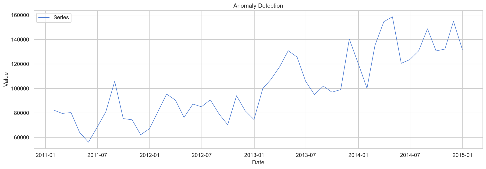

A time-series line chart of the monthly sales series with anomaly points highlighted in red. Anomalies are detected by computing Z-scores on the residuals from the seasonal decomposition and flagging points where |Z| > 3.0 (three standard deviations from the residual mean). In this dataset, **0 anomalies were detected**, meaning the time series follows the expected seasonal pattern without exceptional deviations. If anomalies were present, they would represent months where sales significantly deviated from the seasonal-trend pattern, warranting investigation.

---

### 27. Feature Importance

**Chart Type:** Horizontal bar chart (Top 20) | **X-axis:** Importance (0–1) | **Y-axis:** Feature name

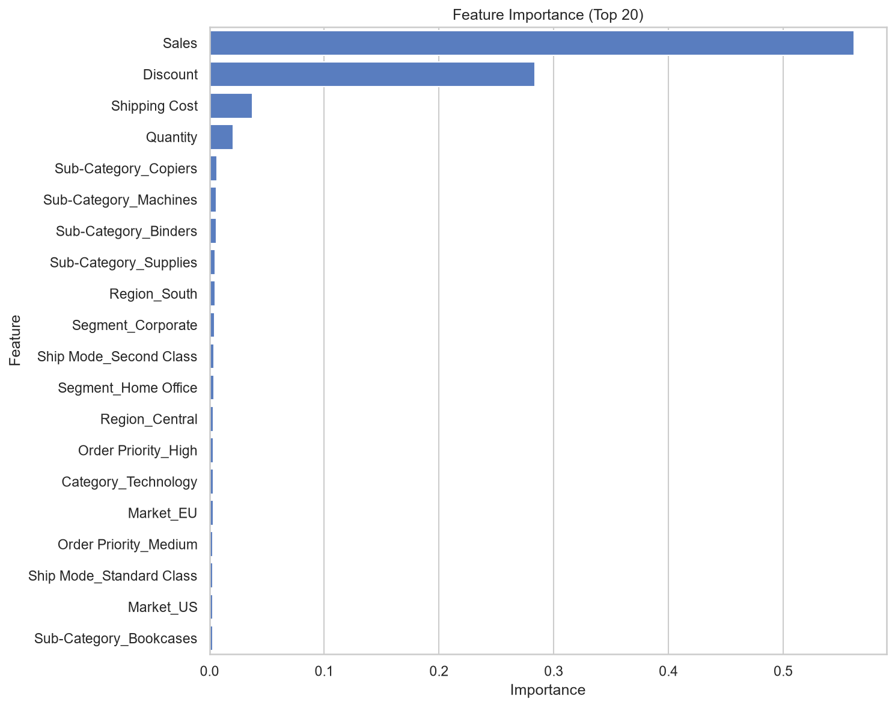

This chart displays the top 20 most important features for the Random Forest profit prediction model, ranked by their `feature_importances_` attribute. **Sales** dominates with an importance of ~0.56 (56% of total importance), followed by **Discount** at ~0.28 (28%). **Shipping Cost**, **Quantity**, and various sub-category and region indicators follow with smaller but meaningful contributions. This chart is critical for understanding which variables drive the predictive model and guides feature selection for model improvement.

---

### 28. Actual vs Predicted

**Chart Type:** Scatter plot | **X-axis:** Actual Profit | **Y-axis:** Predicted Profit

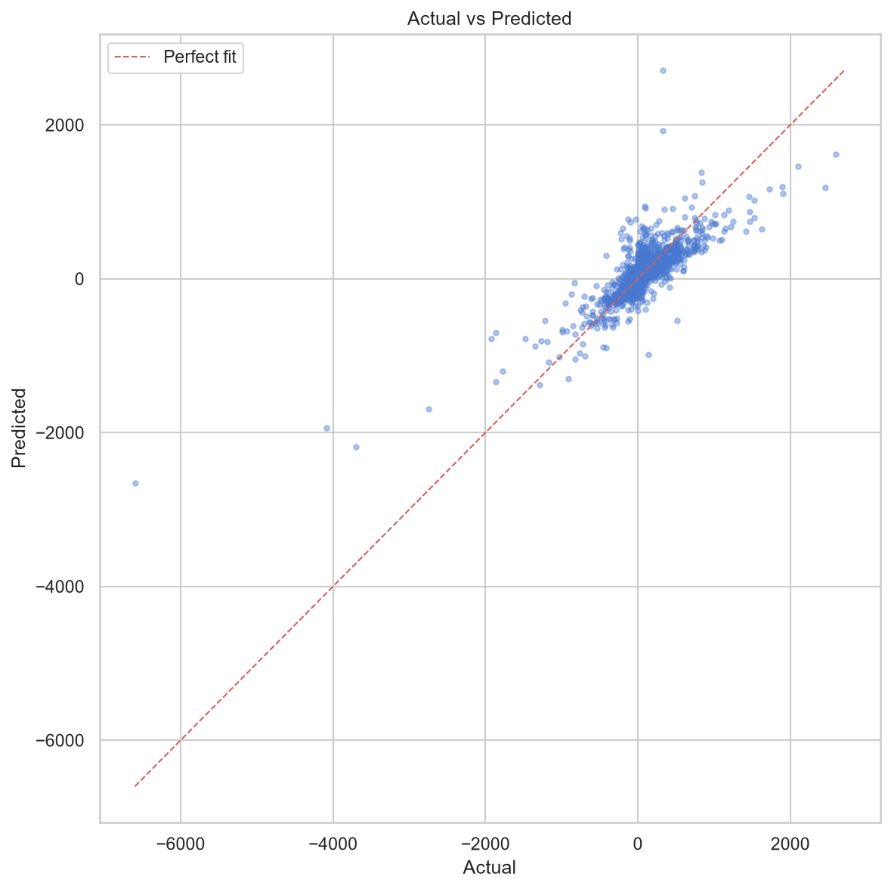

A diagnostic scatter plot comparing the Random Forest model’s predicted profit values against the actual test set values. The red dashed line represents perfect prediction (y = x). Points **on the line** indicate accurate predictions; points **off the line** indicate prediction errors. The scatter shows the model’s prediction accuracy — points clustered near the line indicate good performance, while spread away from the line indicates error. This chart reveals whether the model has systematic biases (e.g., consistently over- or under-predicting at certain value ranges).

---

### 29. Residuals

**Chart Type:** Dual-panel chart | **X-axis:** Predicted (left) / Residual (right) | **Y-axis:** Residual (left) / Density (right)

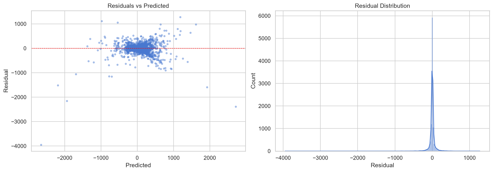

A two-panel diagnostic chart for evaluating the Random Forest model’s residual behavior:

- **Left panel:** A scatter plot of predicted values (X-axis) vs residuals (Y-axis). Residuals scattered randomly around the red zero-reference line with **no discernible systematic pattern** (no curvature, no funnel shape) confirms **homoscedasticity** — the model does not systematically over- or under-predict across the range of predicted values.
- **Right panel:** A histogram with KDE overlay of residual values showing a **roughly bell-shaped distribution** centered near zero, with slightly heavier tails.

This validates the model’s assumptions and confirms there are no major structural issues in the predictions.

---

## Customer Analytics

### Repeat Customer Analysis

| Metric | Value |
|--------|-------|
| Total Customers | 1,590 |
| Repeat Customers | 1,580 |
| One-Time Customers | 10 |
| Repeat Rate | 99.37% |
| Repeat Revenue Share | 99.97% |

The dataset shows an extraordinarily high repeat customer rate of 99.37%, with only 10 one-time purchasers out of 1,590 total customers. Repeat customers contribute 99.97% of all revenue, demonstrating that the business model is heavily dependent on customer retention and loyalty.

### RFM Segmentation Table

| Segment | Count | Description |
|---------|-------|-------------|
| Champions | 373 | High recency, high frequency — best customers |
| Potential Loyalist | 310 | Recent, moderate frequency — future loyalists |
| Loyal Customer | 263 | High frequency, lower recency — reliable buyers |
| Lost | 261 | Low recency, low frequency, low monetary — at risk of leaving |
| Promising | 179 | Recent, low frequency — early-stage customers |
| At Risk | 125 | Low recency, high frequency — previously loyal, now drifting |
| Recent Customer | 40 | Very recent, low frequency — new customers |
| Hibernating | 39 | Low recency, low frequency, high monetary — dormant high-value |

**Champions** and **Potential Loyalists** together comprise 43% of the customer base and drive disproportionate revenue. **At Risk**, **Hibernating**, and **Lost** segments represent customers requiring targeted re-engagement campaigns.

### Top 10 Customers by Sales

| Customer ID | Customer Name | Sales | Profit | Orders | Avg Order Value |
|-------------|---------------|-------|--------|--------|-----------------|
| TA-21385 | Tom Ashbrook | $35,668.10 | $6,274.99 | 25 | $1,426.72 |
| GT-14710 | Greg Tran | $34,471.90 | $5,164.85 | 30 | $1,149.06 |
| TC-20980 | Tamara Chand | $34,218.30 | $8,787.47 | 28 | $1,222.08 |
| SM-20320 | Sean Miller | $31,125.30 | -$1,083.67 | 21 | $1,482.16 |
| BW-11110 | Bart Watters | $30,613.60 | $3,337.47 | 35 | $874.68 |
| HL-15040 | Hunter Lopez | $29,664.20 | $7,657.50 | 20 | $1,483.21 |
| SE-20110 | Sanjit Engle | $29,532.60 | $5,863.62 | 36 | $820.35 |
| PS-19045 | Penelope Sewall | $29,252.30 | $4,426.20 | 26 | $1,125.09 |
| RB-19360 | Raymond Buch | $29,197.60 | $8,523.95 | 25 | $1,167.91 |
| ZC-21910 | Zuschuss Carroll | $28,472.80 | $452.50 | 37 | $769.54 |

---

## Product Analytics

### Category Performance

| Category | Sales | Profit | Margin % | Orders | Unique Products | Avg Discount % |
|----------|-------|--------|----------|--------|-----------------|----------------|
| Technology | $4,744,560 | $663,779 | 13.99% | 8,354 | 2,375 | 13.53% |
| Furniture | $4,110,870 | $285,205 | 6.94% | 8,195 | 2,228 | 16.81% |
| Office Supplies | $3,787,070 | $518,474 | 13.69% | 19,003 | 5,689 | 13.74% |

**Technology** generates the highest sales and profit, with a strong 13.99% margin. **Furniture** has the second-highest sales but a notably lower margin of 6.94%, driven by higher discount rates (16.81% avg) and higher shipping costs. **Office Supplies** has the highest order volume (19,003 orders) with a competitive 13.69% margin.

### Sub-Category Deep Dive (Top 10 by Sales)

| Sub-Category | Sales | Profit | Margin % | Avg Order Value | Profit/Unit | Avg Discount % | Quadrant |
|--------------|-------|--------|----------|-----------------|-------------|----------------|----------|
| Phones | $1,706,820 | $216,717 | 12.70% | $544.79 | $18.26 | 14.58% | Stars |
| Copiers | $1,509,440 | $258,568 | 17.13% | $712.00 | $34.69 | 11.71% | Stars |
| Chairs | $1,501,680 | $140,396 | 9.35% | $471.19 | $11.38 | 16.31% | Stars |
| Bookcases | $1,466,570 | $161,924 | 11.04% | $642.11 | $19.49 | 15.38% | Stars |
| Storage | $1,127,090 | $108,461 | 9.62% | $248.59 | $6.41 | 13.85% | Stars |
| Appliances | $1,011,060 | $141,681 | 14.01% | $599.68 | $23.31 | 14.17% | Stars |
| Machines | $779,060 | $58,867.90 | 7.56% | $547.86 | $12.00 | 16.96% | Question Marks |
| Tables | $757,042 | -$64,083.40 | -8.46% | $905.55 | -$20.79 | 29.07% | Question Marks |
| Accessories | $749,237 | $129,626 | 17.30% | $259.34 | $11.84 | 12.05% | Stars |
| Binders | $461,912 | $72,449.80 | 15.68% | $85.67 | $3.38 | 17.92% | Cash Cows |

### Profitability Matrix (BCG-style Quadrant Analysis)

| Quadrant | Sub-Categories | Description |
|----------|---------------|-------------|
| **Stars** (High Sales, High Profit) | Accessories, Appliances, Art, Bookcases, Chairs, Copiers, Phones, Storage | Strong performers — invest and grow |
| **Cash Cows** (Low Sales, High Profit) | Binders, Paper | Profitable but lower volume — maintain and milk |
| **Question Marks** (High Sales, Low Profit) | Machines, Tables | High revenue but low profitability — improve margins or divest |
| **Dogs** (Low Sales, Low Profit) | Envelopes, Fasteners, Furnishings, Labels, Supplies, Art | Low impact — evaluate for discontinuation |

**Key insight**: **Tables** is the only sub-category with negative total profit (-$64,083.40), driven by an extremely high average discount rate of 29.07% and negative profit per unit (-$20.79). **Paper** has the highest margin at 24.24% with a low discount of 10.95%, making it a high-efficiency product.

### Pareto Analysis

- **Top 20% of products (758 out of 3,788 SKUs) account for 70.11% of total sales**, validating the Pareto principle (80/20 rule).
- The curve rises steeply at the beginning (top products) and then flattens, showing diminishing returns for lower-ranked products.

---

## Geographic Analysis

### Distribution Summary

| Metric | Value |
|--------|-------|
| Total Countries | 147 |
| Total States | 1,094 |
| Total Cities | 3,636 |
| Total Postal Codes | 14,138 |
| Total Regions | 13 |
| Total Markets | 7 |
| Top Country by Sales | United States |
| Top State by Sales | England |
| Top City by Sales | New York City |

### Market Performance

| Market | Sales | Profit | Margin % | Customers | Avg Order Value |
|--------|-------|--------|----------|-----------|-----------------|
| APAC | $3,585,740 | $436,000 | 12.16% | 796 | $659.51 |
| EU | $2,938,090 | $372,830 | 12.69% | 795 | $639.69 |
| US | $2,297,200 | $286,397 | 12.47% | 793 | $458.61 |
| LATAM | $2,164,610 | $221,643 | 10.24% | 794 | $421.29 |
| EMEA | $806,161 | $43,898 | 5.45% | 760 | $327.44 |
| Africa | $783,773 | $88,871.60 | 11.34% | 754 | $351.15 |
| Canada | $66,928.20 | $17,817.40 | 26.62% | 181 | $332.98 |

**Canada** has the highest margin (26.62%) despite the lowest volume, indicating an opportunity for growth. **EMEA** has the lowest margin (5.45%) despite significant volume, suggesting discount pressure or cost issues in that market.

### Regional Comparison (Top 5 by Sales)

| Region | Sales | Profit | Margin % | Sales Share % |
|--------|-------|--------|----------|---------------|
| Central | $2,822,300 | $311,404 | 11.03% | 22.32% |
| South | $1,600,910 | $140,356 | 8.77% | 12.66% |
| North | $1,248,170 | $194,598 | 15.59% | 9.87% |
| Oceania | $1,100,180 | $120,089 | 10.92% | 8.70% |
| Southeast Asia | $884,423 | $17,852.30 | 2.02% | 7.00% |

**Southeast Asia** has the lowest margin (2.02%) among top regions, indicating high discount activity. **North** region has the second-highest margin (15.59%) despite being third in sales volume.

---

## Time Series & Forecasting

### Time Series Decomposition Results

The monthly sales series (48 observations, Jan 2011 – Dec 2014) was decomposed using **additive seasonal decomposition** (statsmodels, period=12), yielding four components:

- **Observed**: Original series with clear seasonal peaks in Nov–Dec
- **Trend**: Steady upward growth from ~$150K–$200K/month (2011) to ~$250K–$300K+/month (2014)
- **Seasonal**: Repeating annual pattern with amplitude of ~±$15,000; peaks in Nov–Dec, troughs in Feb–Mar
- **Residual**: Random noise centered near zero (no systematic pattern)

### ARIMA Forecast

- **Model**: ARIMA(1,1,1) — 12-step-ahead forecast with 95% confidence intervals
- **Forecast horizon**: Jan 2015 – Dec 2015
- The forecast continues the upward trend with seasonal oscillations, capturing the annual spike pattern
- Confidence intervals widen over the forecast horizon, reflecting increasing uncertainty

### Anomaly Detection

- **Method**: Z-score on decomposition residuals (threshold: |Z| > 3.0)
- **Anomalies detected**: 0
- **Interpretation**: The time series follows the expected seasonal-trend pattern without exceptional deviations

---

## Predictive Modelling

### Model Performance Comparison

| Metric | Random Forest | XGBoost |
|--------|---------------|---------|
| MAE | $34.78 | $35.70 |
| RMSE | $100.78 | $104.36 |
| R² | 0.66 | 0.63 |

**Random Forest slightly outperforms XGBoost** on all three metrics in this configuration. The model explains approximately 66% of the variance in profit, which is reasonable given the noise and complexity of retail sales data.

### Model Configuration

- **Random Forest**: 200 estimators, max_depth=15, random_state=42, n_jobs=-1
- **XGBoost**: 200 estimators, max_depth=8, learning_rate=0.1 (optional — only if installed)
- **Train/Test Split**: Chronological 80/20 split by Order Date (no random shuffling to prevent data leakage)
- **Features**: Sales, Quantity, Discount, Shipping Cost + one-hot encoded categoricals (Category, Sub-Category, Segment, Region, Market, Ship Mode, Order Priority)

### Top 10 Feature Importances (Random Forest)

| Feature | Importance | Interpretation |
|---------|------------|----------------|
| Sales | 0.5617 | Dominant predictor — order value drives profit |
| Discount | 0.2835 | Second most important — discounting erodes margins |
| Shipping Cost | 0.0375 | Moderate impact on profitability |
| Quantity | 0.0206 | Unit count has minor predictive value |
| Sub-Category_Copiers | 0.0063 | Product type matters |
| Sub-Category_Machines | 0.0061 | Product type matters |
| Sub-Category_Binders | 0.0060 | Product type matters |
| Sub-Category_Supplies | 0.0049 | Product type matters |
| Region_South | 0.0048 | Regional variation |
| Segment_Corporate | 0.0045 | Customer segment effect |

**Key insight**: Sales and Discount together account for **84.5%** of total feature importance, indicating that pricing and discounting are the primary drivers of profit. Categorical features (sub-categories, regions, segments) contribute smaller but meaningful predictive signal.

### Model Diagnostics

- **Residuals plot**: Points scattered randomly around zero with no systematic pattern — confirms homoscedasticity
- **Residual distribution**: Roughly bell-shaped, centered near zero — validates normality assumption
- **Actual vs Predicted**: Points broadly follow the perfect-fit line, with spread increasing at higher profit values

---

## Outputs & Deliverables

| Output | Path | Description |
|--------|------|-------------|
| Cleaned Dataset | `Data/superstore_clean.csv` | 51,290 rows with 12+ engineered features |
| Final Report | `Outputs/final_report.md` | Comprehensive markdown summary |
| HTML Dashboard | `Outputs/HTML/dashboard.html` | Interactive dashboard with embedded data |
| HTML Report | `Outputs/HTML/report.html` | Formatted HTML report |
| Excel Workbook | `Excel/SalesAnalysis_Report.xlsx` | 4-sheet workbook (Quality, EDA, Statistics, Sample) |
| PDF Report | `Reports/SalesAnalysis_Report.pdf` | Printable analysis report |
| Word Document | `Documentation/Project_Report.docx` | Business-formatted report |
| SQLite Database | `SQL/superstore.db` | 6-table relational database |
| SQL Scripts | `SQL/*.sql` | 10 SQL scripts (schema, analysis, procedures, etc.) |
| Visualizations | `Visualizations/*.png` | 29 chart PNGs at 150 DPI |
| Pipeline Logs | `Logs/*.log` | Per-module execution logs |

### Excel Workbook Sheets

| Sheet | Content |
|-------|---------|
| Data_Quality_Report | Column profiling: missing %, duplicate counts, data types |
| EDA_Summary | Numeric statistics (count, mean, std, min, max, skew, kurtosis) |
| Statistical_Summary | All 5 hypothesis test results |
| Cleaned_Sample | First 1,000 rows of cleaned data |

---

## Key Findings & Business Recommendations

### Key Findings

1. **Discount-Profit Inverse Relationship**: Pearson r = -0.32 (p < 0.001). Higher discounts directly reduce profitability. Tables (29.07% avg discount) and Machines (16.96%) are most affected.

2. **Category Matters**: One-way ANOVA (F = 2,990.28, p < 0.001) confirms significant sales differences across categories. Technology leads in both sales and profit.

3. **Strong Seasonality**: November–December peaks generate ~+$15,000 above average monthly sales. February–March are the weakest months.

4. **Pareto Principle Validated**: Top 20% of SKUs generate 70.11% of revenue. Focus inventory and marketing on these products.

5. **Exceptional Repeat Rate**: 99.37% repeat customer rate and 99.97% revenue from repeat customers — retention is everything.

6. **Regional Disparities**: Central region leads in sales (22.32% share). Canada has the highest margin (26.62%) but lowest volume — a growth opportunity.

7. **Model Predictability**: Random Forest achieves R² = 0.66, with Sales and Discount explaining 84.5% of feature importance.

### Business Recommendations

1. **Reduce discount depth** on low-margin products (especially Tables, Machines) where the discount-profit correlation is significant
2. **Focus inventory and marketing** on top-performing Pareto products (top 20% of SKUs)
3. **Target high-value RFM segments** (Champions, Potential Loyalists) with retention and upselling programs
4. **Develop re-engagement campaigns** for At Risk, Hibernating, and Lost customer segments
5. **Optimize shipping modes by region** — maintain premium shipping where it drives profit, standardize where it doesn’t
6. **Implement seasonal planning** based on time-series decomposition — ramp up inventory before Nov–Dec peaks, reduce in Feb–Mar
7. **Expand Canada market** — highest margin (26.62%) with low volume suggests untapped potential
8. **Review Tables sub-category** — only category with negative total profit; consider repricing or discontinuation
9. **Invest in Technology category** — highest sales, highest profit, strong margins
10. **Leverage Office Supplies volume** — highest order count with competitive margins; opportunity for bulk discounts from suppliers

---
